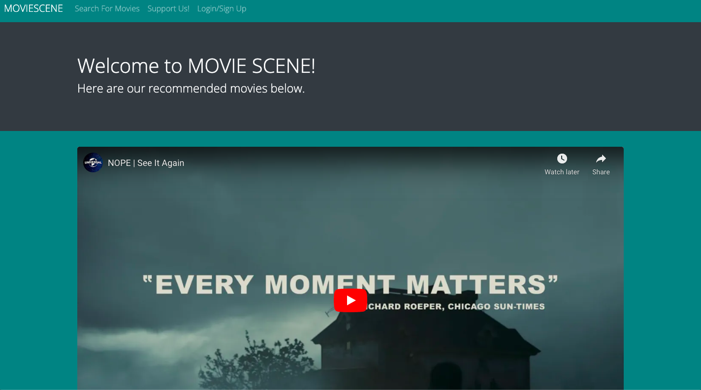
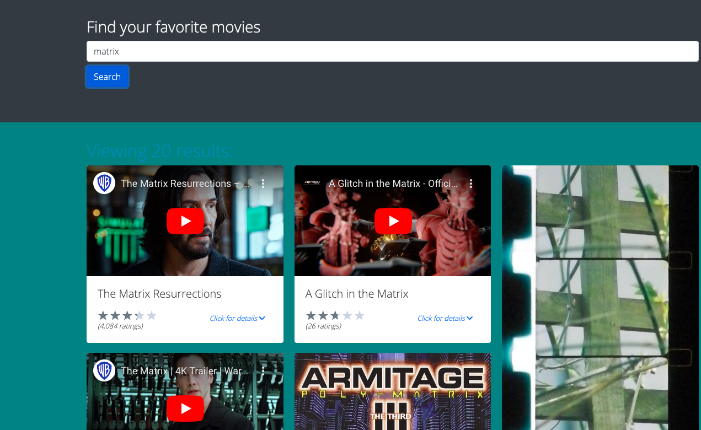
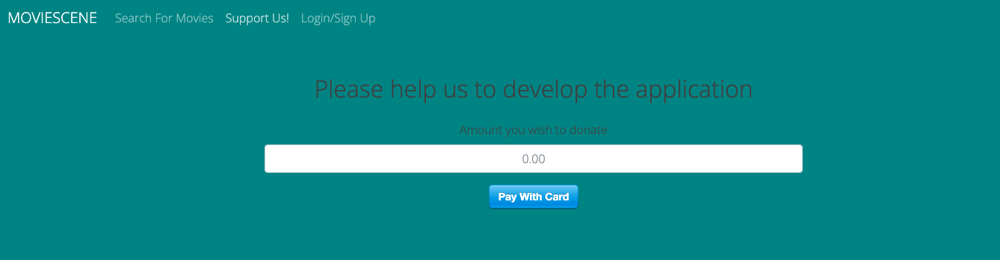

# Movie Scene

## Table of Contents

- [Description](#description)
- [Techologies](#techologies)
- [Usage](#usage)
- [Contribution](#contribution)
- [Copyright](#copyright)
- [Questions](#questions)
- [Link](#link)

## Description:

This is our application for the final project in the UW Coding Bootcamp. We created an application to help users search their favorite movies. Users can sign into their profile, search the movie and save the movies they like. Users can also surport us by clicking the support button.

## Techologies:

- Use React for the front end.
- Use GraphQL with a Node.js and Express.js server.
- Use MongoDB and the Mongoose ODM for the database.
- Use queries and mutations for retrieving, adding, updating, and deleting data.

## Usage:

Final project for UW BootCamp

## Contribution:

Contributed by: Holly, Jawid, Jing, Sherry, Socheata and Leah

## Copyright:

Copyright © 2022 <Holly, Jawid, Jing, Sherry, Socheata and Leah >.
Licensed under the [MIT License](LICENSE).

## Questions:

If you have any questions, please reach out to any of us:

- Hajikak4030@gmail.com
- jeanlee.jingli@icloud.com
- thehallers@icloud.com
- sherryk816@gmail.com
- leah.skeen2011@hotmail.co
- lycheata45@gmail.com

## Link

- [Link to the GitHub Repo](https://github.com/Jawidanfar1015/Project-3-group-2)
- [Deployed here](https://movie-scene.herokuapp.com/)
- Screen_Shot of App_HomePage:
- Screen_Shot of App_SearchMovie:
- Screen_Shot of App_SupportUs:

                            Copyright © 2022
